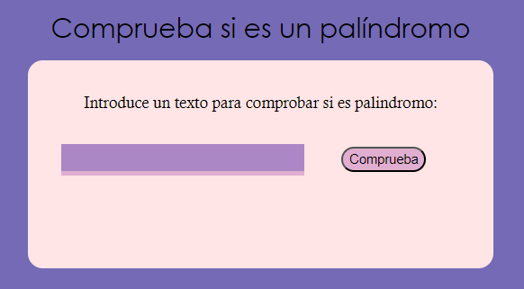

# ¿Qué es esto?
Este es un proyecto de freeCodeCamp al que decidí crear una versión de escritorio para practicar con node.js y electron.js.

 

# Como instalar en local
Para este proyecto se necesita, además de node.js, electron.js.
```
npm install electron --save-dev
```

También si quieres hacer tu build se necesita electron-builder.

```
npm install electron-builder --save-dev
```

Notese como se usa *--save-dev* en vez de *--save* en ambos ya que no queremos que se guarde en las dependencias finales en el .json, eso haría que la build final los tuviera y aumentaría innecesariamente el tamaño.

Para saber como usarlos vean la documentación de [electron.js](https://www.electronjs.org/docs/latest/tutorial/tutorial-first-app) y [electron-builder](https://www.electron.build/index.html).
---

# What's this?
A freeCodeCamp proyect that I decided to create a desktop version for practice in node.js & electron.js.

 

# How to install in your machine
For this project, in addition to node.js, electron.js is needed.
```
npm install electron --save-dev
```

If you also want to make your own build you'll need electron-builder.

```
npm install electron-builder --save-dev
```

Take note at how *--save-dev* is used instead of *--save* in both installations as we don't want the .json to mark them as final dependecies, which would add them into the final build and would needlessly increase build size.

To know how to use them read the documentation of [electron.js](https://www.electronjs.org/docs/latest/tutorial/tutorial-first-app) & [electron-builder](https://www.electron.build/index.html).
